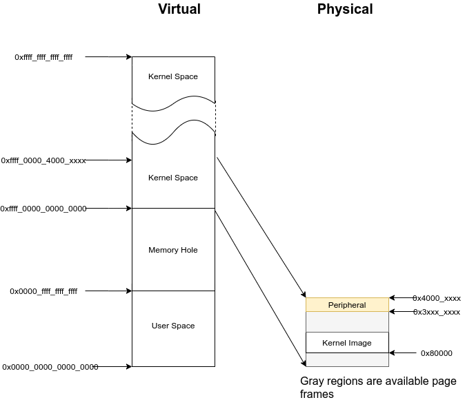

======================
Lab 8 : Virtual Memory
======================

************
Introduction
************

Virtual memory provides isolated address spaces, 
so each user process can run in its address space without interfering with others.

In this lab, you need to initialize the memory management unit(MMU) and 
set up the address spaces for the kernel and user processes to achieve process isolation

*******************
Goals of this lab
*******************

* Understand ARMv8-A virtual memory system architecture.
* Understand how the kernel manages memory for user processes.
* Understand how demand paging works.
* Understand how copy-on-write works.

*******************
Background
*******************

Terminology
============

Translation Levels
--------------------

Translating a virtual address to a physical address involves levels of translation.
ARMv8-A has 2 to 4 levels of translation for different page sizes and the second stage translation for hypervisors. (not used in labs)

We name each level as in Linux.
The top-level is the page global directory (PGD) followed by page upper directory (PUD), page middle directory (PMD), and page table entry(PTE).

Page v.s. Page Frame v.s. Page Table
-------------------------------------

**Page**: A chunk of virtual memory pointed by one entry of PTE.

**Block**: A chunk of virtual memory pointed by one entry of PUD or PMD.

**Page frame**: A chunk of physical memory.

**Page table**: A page frame whose entries point to the next level page tables, blocks, or pages.
In this documentation, PGD, PUD, PMD, and PTE are all called page tables.

Page's Descriptor
===================

As mentioned earlier, each entry of a page table points to the next level page table, a block, or a page.
The entry is combined with the page frame physical address and attributes of the region.

We list the necessary content for you.

Descriptor's Format(simplified)
---------------------------------

.. code:: none

  Entry of PGD, PUD, PMD which point to a page table

  +-----+------------------------------+---------+--+
  |     | next level table's phys addr | ignored |11|
  +-----+------------------------------+---------+--+
       47                             12         2  0

  Entry of PUD, PMD which point to a block

  +-----+------------------------------+---------+--+
  |     |  block's physical address    |attribute|01|
  +-----+------------------------------+---------+--+
       47                              n         2  0

  Entry of PTE which point to a page

  +-----+------------------------------+---------+--+
  |     |  page's physical address     |attribute|11|
  +-----+------------------------------+---------+--+
       47                             12         2  0

  Invalid entry

  +-----+------------------------------+---------+--+
  |     |  page's physical address     |attribute|*0|
  +-----+------------------------------+---------+--+
       47                             12         2  0

.. _page_attr:

Attributes Used in this Lab
---------------------------------

**Bits[54]**
  The unprivileged execute-never bit, non-executable page frame for EL0 if set.

**Bits[53]**
  The privileged execute-never bit, non-executable page frame for EL1 if set.

**Bits[47:n]**:
  The physical address the entry point to.
  Note that the address should be aligned to :math:`2^n` Byte.

**Bits[10]**
  The access flag, a page fault is generated if not set.

**Bits[7]**
  0 for read-write, 1 for read-only.
  
**Bits[6]**
  0 for only kernel access, 1 for user/kernel access.

**Bits[4:2]**
  The index to MAIR.

**Bits[1:0]**
  Specify the next level is a block/page, page table, or invalid. 

.. warning::
  If you set Bits[7:6] to 0b01, which means the user can read/write the region,
  then the kernel is automatically not executable in that region no matter what the value of Bits[53] is.

AArch64 memory layout
========================

In the 64-bit virtual memory system, the upper address space is usually for kernel mode, and the lower address space is for user mode.

.. note::
  The entire accessible physical address could be linearly mapped by to offset 0xffff_0000_0000_0000 for kernel access in the labs.
  It simplfies the design.

Configuration
===============

ARMv8-A has the elasticity for different configurations.
You can change the granularity of paging, the addressable region, etc.
To keep everything simple, the following configuration is specified for this lab.

* Disable instruction cache.
* Disable data cache.
* The addressable region is 48 bit.
* The page granule size is 4KB.
* Not use address space ID (ASID).

Reference
============

So far, we briefly introduce the concept of virtual memory and ARMv8-A virtual memory system architecture.
For details, you can refer to 

* `ARMv8-A Address Translation <https://developer.arm.com/documentation/100940/0101>`_
* **The AArch64 Virtual Memory System Architecture Chapter(page 1720)** of `ARMv8-A Architecture Reference <https://developer.arm.com/documentation/ddi0487/aa/?lang=en>`_

*********
Required
*********

Requirement 1
===============

We provide a step-by-step tutorial to guide you to make your original kernel works with virtual memory.
However, we only give the essential explanation in each step.
For details, please refer to the manual.

Translation Control Register (TCR)
-----------------------------------

Paging is configured by TCR.
The following basic configuration is used in this lab.

.. code:: c
 
  #define TCR_CONFIG_REGION_48bit (((64 - 48) << 0) | ((64 - 48) << 16))
  #define TCR_CONFIG_4KB ((0b00 << 14) |  (0b10 << 30))
  #define TCR_CONFIG_DEFAULT (TCR_CONFIG_REGION_48bit | TCR_CONFIG_4KB)

  ldr x0, = TCR_CONFIG_DEFAULT
  msr tcr_el1, x0

``required 1-1`` Set up TCR_EL1.

Memory Attribute Indirection Register (MAIR)
---------------------------------------------

Brief Introduction
^^^^^^^^^^^^^^^^^^^

The MMU has different memory **access policies** for different **memory regions**.

* Memory **access policies** are encoded as attributes and stored in MAIR.

* To select the attribute for a certain **memory region**, each page table's entry contains the index to the attribute. (see :ref:`page_attr`)

When the MMU gets a virtual address, it gets the index from the page table's entry and looks up MAIR to get the memory attribute.
Then, it accesses the memory with different access policies.

Used Memory Attributes
^^^^^^^^^^^^^^^^^^^^^^^

The following two attributes are used in the lab.

* Device memory nGnRnE:
  
  * Peripheral access.

  * The most restricted memory access.

* Normal memory without cache:

  * Normal RAM access.

  * Memory gathering, reordering, and speculative execution are possible but without cache.

.. code:: c
 
  #define MAIR_DEVICE_nGnRnE 0b00000000
  #define MAIR_NORMAL_NOCACHE 0b01000100
  #define MAIR_IDX_DEVICE_nGnRnE 0
  #define MAIR_IDX_NORMAL_NOCACHE 1

  ldr x0, =( \
    (MAIR_DEVICE_nGnRnE << (MAIR_IDX_DEVICE_nGnRnE * 8)) | \
    (MAIR_NORMAL_NOCACHE << (MAIR_IDX_NORMAL_NOCACHE * 8)) \
  )
  msr mair_el1, x0

``required 1-2`` Set up ``mair_el1``.

Identity Paging
----------------

Before enabling the MMU, you need to set up the page tables for the kernel.
You can start from identity paging with two-level translation.

In a two-level translation, you only need PGD and PUD.
Each entry of PUD points to a 1GB block. 
Hence, you only need

* The first entry of PGD which points to PUD 

* The first two entries of PUD.

  * The first one maps 0x00000000 - 0x3fffffff (RAM and GPU peripherals) 

  * The second one maps 0x40000000 - 0x7fffffff(ARM local peripherals).

**setup**

* 2 page frames for PGD and PUD.

* PUD's entries are blocks.

* Map all memory as Device nGnRnE.

.. code:: c

  #define PD_TABLE 0b11
  #define PD_BLOCK 0b01
  #define PD_ACCESS (1 << 10)
  #define BOOT_PGD_ATTR PD_TABLE
  #define BOOT_PUD_ATTR (PD_ACCESS | (MAIR_IDX_DEVICE_nGnRnE << 2) | PD_BLOCK)

  mov x0, 0 // PGD's page frame at 0x0 
  mov x1, 0x1000 // PUD's page frame at 0x1000

  ldr x2, = BOOT_PGD_ATTR 
  orr x2, x1, x2 // combine the physical address of next level page with attribute.
  str x2, [x0]

  ldr x2, = BOOT_PUD_ATTR
  mov x3, 0x00000000
  orr x3, x2, x3 
  str x3, [x1] // 1st 1GB mapped by the 1st entry of PUD
  mov x3, 0x40000000
  orr x3, x2, x3 
  str x3, [x1, 8] // 2nd 1GB mapped by the 2nd entry of PUD

  msr ttbr0_el1, x0 // load PGD to the bottom translation based register.

  mrs x2, sctlr_el1
  orr x2 , x2, 1
  msr sctlr_el1, x2 // enable MMU, cache remains disabled

If you set up correctly, your kernel should work as before.

``required 1-3`` Set up identity paging.

Map the Kernel Space
---------------------

As mentioned earlier, the kernel space is the upper address space.
Now, you need to modify your linker script to make your kernel's symbols in the upper address space.

.. code:: none

  SECTIONS
  {
    . = 0xffff000000000000; // kernel space
    . += 0x80000; // kernel load address
    _kernel_start = . ;
    // ...
  }

After the kernel is re-built and loaded, load the identity paging's PGD to ``ttbr1_el1``.
Next, enable the MMU and using an indirect branch to the virtual address.
Then, the CPU is running your kernel in the upper address space.

.. code:: c

  // ...

  msr ttbr0_el1, x0
  msr ttbr1_el1, x0 // also load PGD to the upper translation based register.
  mrs x2, sctlr_el1
  orr x2 , x2, 1
  msr sctlr_el1, x2 

  ldr x2, boot_rest // indirect branch to the virtual address
  br x2

  boot_rest:
  // ...

``required 1-4`` Modify the linker script, and map the kernel space.

.. note::
  If there is hard-coded address(e.g. IO address) in your kernel, you should also set it to the upper address space.

Finer Granularity Paging
----------------------------------

The granularity of two-level translation is 1GB.
In the previous setting, all memory regions are mapped as device memory.

However, unaligned access of device memory causes alignment exception and the compiler sometimes generates unaligned access.
Hence, you should map most of the RAM as normal memory and MMIO region as device memory.

Then, you should use three level translation(2MB) or four level translation(4KB) for linear mapping.

``required 1-5`` Linear map kernel with finer granularity and map RAM as normal memory.

Requirement 2
===============

PGD Allocation
---------------

To isolate user processes, you should create an address space for each of them.
Hence, the kernel should allocate one PGD for each process when it creates a process.

Map the User Space
-------------------

Same as kernel space mapping, you need to iteratively fill in the entries of page tables from PGD -> PUD -> PMD -> PTE.

During this process, the next level page tables such as PUD, PMD, and PTE may not already present.
You should allocate one page frame to be used as the next level page table.
Then, fill the page frame's entries to map the virtual address.

``required 2-1`` Implement user space paging.

.. note::
  You should use 4KB pages for user processes in this lab, so you need PGD, PUD, PMD, and PTE for four-layer translation.

Revisit Fork and Exec
^^^^^^^^^^^^^^^^^^^^^^

In lab 5, different user programs used different linker scripts to prevent address overlapping.
Also, the child process can't use the same user stack address as the parent.

With virtual memory, the same virtual address can be mapped to different physical addresses.
Therefore, you can to revisit ``fork()`` and ``exec()`` with virtual memory to solve the problems mentioned above.

``required 2-2`` Revisit ``fork()`` and ``exec()`` to map the same virtual address to different physical addresses for different processes.

Context Switch
---------------

To switch between different address spaces, 
you can set the translation based register(``ttbr0_el1``) with different PGDs.

In addition, you might need memory barriers to guarantee previous instructions are finished.
Also, a TLB invalidation is needed because the old values are staled.

.. code:: c
  
  ldr x0, = next_pgd
  dsb ish // ensure write has completed
  msr ttbr0_el1, x0 // switch translation based address.
  tlbi vmalle1is // invalidate all TLB entries
  dsb ish // ensure completion of TLB invalidatation
  isb // clear pipeline

``required 2-3`` Set ``ttbr0_el1`` to switch the address space in context switches.

Simple Page Fault Handler
--------------------------

When the CPU accesses a non-mapped address, a page fault exception is taken.
You should **print the fault address** store in ``far_el1`` in the kernel mode and **terminate the user process**.

``required 2-4`` Implement a simple page fault handler.

Test
=======

Please test your implementation with the following code or equivalent logic code in the demo.

test.c

.. code:: c

  int main(void) {
    int cnt = 0;
    if(fork() == 0) {
      fork();
      fork();
      while(cnt < 10) {
        printf("pid: %d, sp: 0x%llx cnt: %d\n", getpid(), &cnt, cnt++); // address should be the same, but the cnt should be increased indepndently
        delay(1000000);
      }
    } else {
      int* a = 0x0; // a non-mapped address.
      printf("%d\n", *a); // trigger simple page fault.
      printf("Should not be printed\n");
    }
  }

**********
Elective
**********

Mmap
=====

``mmap()`` is the system call to create memory regions for a user process.
Each region can be mapped to a file or anonymous page(the page frames not related to any file) with different protection.
Then, users can create heap and memory-mapped files using the system call.

Besides, the kernel can also use it for implementing the program loader.
Memory regions such as .text and .data can be created by **memory-mapped files**.
Memory regions such as **.bss** and **user stack** can be created by **anonymous page mapping**.

API Specification
------------------

(void*) mmap(void* addr, size_t len, int prot, int flags, int fd, int file_offset)
  The kernel uses **addr** and **len** to create a new valid region for the current process.

    * If **addr** is NULL, the kernel decides the new region's start address

    * If **addr** is not NULL

        * If the new region **overlaps** with existing regions, or **addr** is **not page-aligned**

          * If MAP_FIXED is set, ``mmap()`` is failed

          * Otherwise, the kernel takes **addr** as a hint and decides the new region's start address.

        * Otherwise, the kernel uses **addr** as the new region's start address.

    * The memory region created by ``mmap()`` should be page-aligned, if the **len** is not multiple of the page size, the kernel rounds it up.

  **prot** is the region's access protection

    * PROT_NONE : not accessible

    * PROT_READ : readable

    * PROT_WRITE : writable

    * PROT_EXEC : executable

  The following **flags** should be implemented

    * MAP_FIXED: New region's start should be **addr**, otherwise the ``mmap()`` fails.

    * MAP_ANONYMOUS: New region is mapped to anonymous page. It's usually used for stack and heap.

    * MAP_POPULATE: After ``mmap()``, it directly does :ref:`region_map`. (You don't have to implement it if you implement demand paging)

  **fd** is the mapped file's file descriptor..

  The new region's is mapped to the **file_offset** of the mapped file.
    
    * The file_offset should be page-aligned.

.. note::
  * You don't need to handle the case that the new region overlaps existing regions.

  * We use memory mapped files for the ELF loader. If you don't implement ELF loader, you don't need to implement **fd**, **file_offset**, and **MAP_FIXED**.

.. _region_map:

Region Page Mapping
----------------------

If the user specifies MAP_POPULATE in the ``mmap()`` call.
The kernel should create the page mapping for the newly created region.

* If the region is mapped to anonymous pages

  1. Allocate page frames.

  2. Map the region to page frames, and set the page attributes according to region's protection policy.

* If the region is mapped to a file

  1. Allocate page frames.

  2. Map the region to page frames, and set the page attributes according to region's protection policy.

  3. Copy the file's content to the memory region.

Tests
-----

Please test your implementation with the following code or equivalent logic code in the demo.

illegal_read.c

.. code:: c

  int main(void) {
    char* ptr = mmap(0x1000, 4096, PROT_READ, MAP_ANONYMOUS, -1, 0);
    printf("addr: %llx\n", ptr);
    printf("%d\n", ptr[1000]); // should be 0
    printf("%d\n", ptr[4097]); // should be segfault
  }

illegal_write.c

.. code:: c

  int main() {
    char* ptr = mmap(NULL, 4096, PROT_READ, MAP_ANONYMOUS, -1, 0);
    printf("addr: %llx\n", ptr);
    printf("%d\n", ptr[1000]); // should be 0
    ptr[0] = 1; // should be seg fault
    printf("%d\n", ptr[0]); // not reached
  }

``elective 1`` Implement ``mmap()``.

.. _ELF:

ELF Loader
==========

In this part, you need to implement an ELF loader to replace the raw binary loader.

ELF Parsing
-------------

The difference between raw binary and ELF is the header.
You can get segments information by parsing the ELF file's header

To implement an ELF loader, you only need to care about the ELF header and the program headers.
The following are struct members you need to use for loading a statically linked ELF.

ELF Header
^^^^^^^^^^^

* **e_entry**: The ELF's entry point, you need to set user exception return address to it.

* **e_phoff**: The offset of program headers from ELF's file start. 

* **e_phnum**: The number of program headers

Program Header
^^^^^^^^^^^^^^^

* **p_type**: The type of program header, you only need to care about PT_LOAD (LOAD segments).

* **p_vaddr**: The virtual address should be loaded to.

* **p_offset**: The offset to start of ELF. 

* **p_align**: **p_vaddr** :math:`\equiv` **p_offset** (mod **p_align**) 

* **p_filesz**: The file size, contains .text, .data, etc.

* **p_memsz**: The memory size of the segment. It usually equals **p_filesz**. If the segment contains .bss, it should be larger than **p_filesz**

* **p_flags**: The extra flags, you only need to care about rwx.

.. note::
  Don't confuse the **p_offset** with **file_offset** in ``mmap()``. **p_offset** may not be page-aligned. 

  Don't confuse the **p_vaddr** with **addr** in ``mmap()``. **p_vaddr** may not be page-aligned. 

``elective 2-1`` Parse the ELF header. 

.. hint:: 
  You can check the correctness by readelf -l <your ELF> on linux

ELF reference
^^^^^^^^^^^^^^^

* https://en.wikipedia.org/wiki/Executable_and_Linkable_Format

ELF mapping
--------------

You can use ``mmap()`` to create regions for the ELF file according to the LOAD segments in program headers.

In general, you can use 
:code:`mmap(p_vaddr, p_filesz, p_flags, MAP_FIXED | MAP_POPULATE, bin_start, p_offset); // MAP_POPULATE can be removed if you implement demand paging`
to create memory regions, and :ref:`region_map` can do the mapping and copying jobs for you.

However, there are some cases you need to care about:

p_memsz > p_filesz
^^^^^^^^^^^^^^^^^^^

It usually happens in .bss and .data are in one LOAD segment, or .bss has its own LOAD segment.
In this case, **.data** should still **map to the ELF file** but **.bss** should **map to anonymous page frames** by setting MAP_ANONYMOUS because it's not backed by the ELF file.

If unfortunately, **.bss and .data are in the same segment** and their **boundary is at the middle of a page frame**.
You should 

1. Do the same thing as normal file mapping region as in :ref:`region_map`

2. Initialize the part of the page frame that belongs to .bss to 0.

.. note::
  If you implement demand paging, you should pre-fault on the .data and .bss boundary and make .bss's head 0 initialized.

p_vaddr and p_offset are not page aligned
^^^^^^^^^^^^^^^^^^^^^^^^^^^^^^^^^^^^^^^^^^

The region created by ``mmap`` should be page aligned.
With the MAP_FIXED flag, some parameters need to be modified

* **addr** should be set to **p_vaddr** - (**p_vaddr** MOD **page_size**)

* **file_offset** should be set to **p_offset** - (**p_offset** MOD **page_size**)

* **len** should be set to **p_filesz** + (**p_offset** MOD **page_size**)

``elective 2-2`` Implement ELF mapping.

Page Fault Handler & Demand Paging
======================================

The page frames are pre-allocated in the previous parts.
However, user program might allocate a huge space on heap or memory mapped files without using it.
The kerenl wastes the CPU time and the physical memory on this things.

In this part, your kernel should allocate page frames for user processes on demand.
The kernel only allocates the PGD for newly created process in the beggining.

When a page fault is generated,

* If the fault address is not part of any region in the process's address space,

  * A segmentation fault is generated, and the kernel terminates the process.

* If it's part of one region, 
  
  Follow :ref:`region_map` but only map **one page frame**. for the fault address.

``elective 3`` Implement demand paging.

Copy on Write
================

When a process call ``fork()`` to create a child process,
the kernel needs to copy all the page frames owned by the parent in the previous implementation.
Otherwise, a write by either child or parent might not be awared by the other one and induce error.

However, an ``exec()`` followed by a ``fork()`` call is quite common in UNIX programming.
The original mapping of child would be destoryed and you waste a lot of time on copying never used page frames.
Hence, a copy-on-write mechanism comes to help these odds.

The following statements is a possible copy-on-write implementation.

On Fork a New Process
----------------------

1. Copy the page frames of page tables.

2. Then mark PTE entries of **both child and parent** to be **read-only** even for original read-write pages.

When Either Children or Parent Write to that Page
-------------------------------------------------

A permission fault is generated because the PTE entry marks as read-only, then you should

Check the region's permission in the address space.

* If the corresponding region is **read-only**, then the **segmentation fault** is generated because the user trying to write a read-only region.

* If the corresponding region is **read-write**, then it's a **copy-on-write fault**.
    
  * The kernel should allocate a page frame, copy the data, and modify the table's entry to be correct permission.

.. note::
  ``fork()`` may be executed many times, so page frames may be shared by many children and one parent.
  Hence, you need a reference count for each page frame.
  And you should not reclaim the page frame if there is still someone referring to it.

``elective 4`` Implement copy-on-write.
